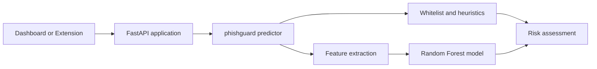

# PhishGuard ML

PhishGuard ML is a Python service that combines a scikit-learn classifier with deterministic URL heuristics to produce phishing-risk assessments. It exposes the detection engine through a FastAPI service, a Streamlit dashboard, a Vercel serverless entry point, and a Manifest V3 browser extension.

This repository is an educational and portfolio project. The model and rules are not a replacement for a production threat-intelligence service, browser isolation, or security review.

## Features

- Hybrid URL analysis using a Random Forest model and heuristic rules.
- Trusted-domain allowlist with a zero-risk result for allowlisted domains.
- Brand-impersonation detection for suspicious domains.
- Optional WHOIS-based domain-age extraction.
- FastAPI JSON API with health and analysis endpoints.
- Streamlit dashboard for interactive analysis.
- Chrome Manifest V3 extension with cloud and local API fallback.
- Pytest unit and API tests with GitHub Actions CI.

## Architecture



The analysis pipeline extracts these features from a URL:

| Feature           | Description                                       |
| ----------------- | ------------------------------------------------- |
| `url_length`      | Total URL length                                  |
| `has_at_symbol`   | Whether the URL contains `@`                      |
| `has_https`       | Whether the URL uses HTTPS                        |
| `no_of_dots`      | Number of dots in the URL                         |
| `has_ip`          | Whether the host is a raw IPv4 address            |
| `hyphen_count`    | Number of hyphens in the URL                      |
| `domain_age_days` | Domain age from WHOIS when enabled; otherwise `0` |

## Repository Layout

```text
.
├── api/                         # Vercel entry point and deployment model copy
├── data/raw/                    # Canonical training dataset
├── extension/                   # Chrome Manifest V3 extension
├── models/                      # Local model artifact and artifact notes
├── scripts/                     # Canonical dataset and model commands
├── src/phishguard/              # Application package
│   ├── api/                     # FastAPI app and request schemas
│   ├── dashboard/               # Streamlit application
│   ├── feature_extractor.py     # URL feature extraction
│   ├── heuristic_engine.py      # Allowlist and rule-based checks
│   └── predictor.py             # Model loading and inference pipeline
├── tests/                       # Unit and API tests
├── app.py                       # Dashboard compatibility launcher
├── main.py                      # Local API compatibility launcher
├── pyproject.toml               # Python package and tool configuration
├── requirements.txt             # Runtime and test dependencies
└── vercel.json                  # Vercel routing configuration
```

The canonical training commands are in `scripts/`. The older dataset/training files under `data/` and `models/` are retained for compatibility with the existing repository history; new development should use the scripts in `scripts/`.

## Documentation

Detailed engineering documentation is available in the [`docs/`](docs/) directory:

- [`docs/project-structure.md`](docs/project-structure.md): exact file-by-file repository inventory and ownership rules.
- [`docs/architecture.md`](docs/architecture.md): runtime request flow, model pipeline, and deployment boundaries.
- [`docs/development.md`](docs/development.md): setup, training, testing, local execution, extension use, and deployment commands.

## Requirements

- Python 3.10 or newer
- pip
- Google Chrome, only if using the extension

## Setup

Create and activate a virtual environment, then install dependencies:

```bash
python -m venv .venv
```

Windows PowerShell:

```powershell
.\.venv\Scripts\Activate.ps1
python -m pip install --upgrade pip
python -m pip install -r requirements.txt
```

macOS or Linux:

```bash
source .venv/bin/activate
python -m pip install --upgrade pip
python -m pip install -r requirements.txt
```

## Train the Model

Generate the canonical dataset and train the model:

```bash
python scripts/create_dataset.py
python scripts/train_model.py
```

This writes the local artifact to `models/phishing_model.pkl` and copies the deployment artifact to `api/phishing_model.pkl`. These files are generated outputs; do not edit them manually.

## Run the API

Start the local FastAPI server:

```bash
python main.py
```

The API is available at `http://127.0.0.1:8000`. Interactive documentation is available at `/docs` and the health check is available at `/health`.

Run the application directly with Uvicorn when the package is on the Python path:

```bash
uvicorn phishguard.api.app:app --app-dir src --reload
```

## Run the Dashboard

```bash
streamlit run app.py
```

The dashboard accepts a URL and displays the final risk score, verdict, threat factors, and extracted features.

## API Usage

### `POST /api/analyze`

Request:

```json
{
  "url": "https://example.com",
  "enable_whois": false
}
```

The legacy routes `/analyze` and `/api/main/analyze` are also supported for existing clients and deployment configuration.

Example response:

```json
{
  "url": "https://example.com",
  "risk_score": 0,
  "base_score": 12,
  "verdict": "SAFE (Whitelisted)",
  "is_whitelisted": true,
  "is_brand_spoof": false,
  "threat_factors": [],
  "features": {
    "url_length": 19,
    "has_at_symbol": 0,
    "has_https": 1,
    "no_of_dots": 1,
    "has_ip": 0,
    "hyphen_count": 0,
    "domain_age_days": 0
  }
}
```

## Test and Quality Checks

Run the test suite:

```bash
python -m pytest
```

Compile the Python sources without executing the application:

```bash
python -m compileall -q src scripts main.py app.py api/main.py
```

GitHub Actions runs the pytest suite for pushes and pull requests. The current tests cover feature extraction, heuristic behavior, and the FastAPI endpoint contract.

## Vercel Deployment

The Vercel configuration uses `api/main.py` as the serverless entry point:

```bash
vercel deploy
```

Before deploying, run the training command so `api/phishing_model.pkl` contains the intended model artifact. The serverless API disables WHOIS lookups for predictable request behavior.

## Browser Extension

1. Open `chrome://extensions` in Chrome.
2. Enable **Developer mode**.
3. Select **Load unpacked**.
4. Choose the repository's `extension/` directory.

The extension tries the configured cloud endpoint first and then the local API at `http://127.0.0.1:8000/api/analyze`.

## Security and Privacy Notes

- The API accepts and processes the submitted URL; callers should avoid sending sensitive URLs to an untrusted deployment.
- CORS is currently permissive to support the browser extension. Restrict `allow_origins` before using this service in a production environment.
- WHOIS lookups are external network requests and may be slow or unavailable.
- A model score is not proof that a website is safe or malicious. Treat the result as one signal in a broader security workflow.

## License and Project Status

This project is intended for educational and portfolio use. Add a project license before distributing it as an open-source package.
