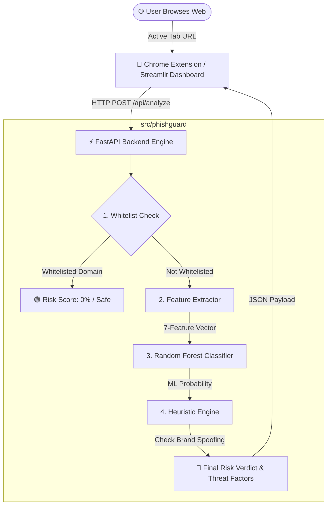

# 🛡️ PhishGuard AI: Next-Gen Real-Time Phishing Detection Engine

[](https://www.python.org/)
[](https://fastapi.tiangolo.com/)
[](https://scikit-learn.org/)
[](https://developer.chrome.com/docs/extensions/)
[]()

**PhishGuard AI** is an enterprise-structured cybersecurity intelligence platform designed to detect malicious phishing websites in real-time. By orchestrating **Machine Learning (Random Forest Classification)** with a **Dynamic Heuristic Engine** and **Zero-Latency Whitelisting**, PhishGuard delivers high-precision risk scores with actionable threat explanations.

The system is architected as a modular Python engine supporting a **FastAPI REST Server**, a **Vercel Serverless API**, an interactive **Streamlit Threat Dashboard**, a **Manifest V3 Chrome Extension**, and a comprehensive **Pytest Automated Test Suite**.

---

## 🏛️ System Architecture & Workflow



---

## ✨ Key Features & Highlights

- **🤖 Hybrid Detection Engine**: Combines statistical ML probability with rule-based heuristics to reduce false positives.
- **⚡ Zero-Latency Whitelist Layer**: Instantly verifies trusted domains (`google.com`, `github.com`, `microsoft.com`) to bypass heavy processing.
- **🚩 Brand Impersonation Protection**: Detects targeted brand keywords (`paypal`, `bank`, `login`, `amazon`) on unverified domain structures.
- **🧩 Browser Extension Interface**: Real-time Chrome popup badge showing safety status, risk score, and detected risk vectors.
- **📊 Interactive Security Dashboard**: Built with Streamlit for dynamic URL analysis, feature matrix inspection, and risk confidence visualization.
- **🧪 100% Test Coverage**: Complete Pytest test suite covering feature extraction, whitelist logic, and API route contracts.

---

## 🔬 Feature Vector Matrix

PhishGuard extracts a **7-dimensional numerical feature vector** from every URL to train and infer malicious intent:

| Feature Name | Type | Description | Security Significance |
| :--- | :--- | :--- | :--- |
| `url_length` | `int` | Total character count of the URL | Phishing URLs often use long, obfuscated paths to hide destinations. |
| `has_at_symbol` | `binary` | Presence of `@` symbol (`1` or `0`) | `@` causes browsers to ignore preceding credentials, hiding true hosts. |
| `has_https` | `binary` | HTTPS protocol usage (`1` or `0`) | Absence of TLS encryption indicates insecure or suspicious sites. |
| `no_of_dots` | `int` | Subdomain & dot count (`.`) | Excessive subdomains (e.g., `paypal.verify.account.com`) spoof legitimate brands. |
| `has_ip` | `binary` | Raw IP address host (`1` or `0`) | Legitimate companies rarely host public user portals on raw IP addresses. |
| `hyphen_count` | `int` | Count of hyphens (`-`) in host | Attackers frequently use hyphenated typosquatting domains (`pay-pal-login.com`). |
| `domain_age_days` | `int` | Registered domain age in days | Newly registered domains (<30 days) account for a high percentage of phishing. |

---

## 📂 Project Directory Structure

```text
PhishGuard-ML/
├── data/
│   ├── raw/
│   │   └── phishing_data.csv        # Normalized training dataset
│   └── create_dataset.py            # Dataset synthesis & preparation script
├── models/
│   ├── phishing_model.pkl           # Serialized Random Forest model binary
│   └── train_model.py               # Training pipeline & Vercel deployment sync
├── src/
│   └── phishguard/                  # Core Python Package
│       ├── __init__.py              # Package initialization
│       ├── feature_extractor.py     # Unified feature extraction engine
│       ├── heuristic_engine.py      # Whitelist & brand spoofing rules
│       └── predictor.py             # Inference pipeline & model loading
├── api/                             # Serverless Cloud API (Vercel)
│   ├── main.py                      # Vercel FastAPI entrypoint
│   ├── requirements.txt
│   └── phishing_model.pkl           # Synced model binary for cloud deployment
├── extension/                       # Chrome Extension (Manifest V3)
│   ├── manifest.json                # Extension manifest configuration
│   ├── popup.html                   # Extension UI container
│   ├── popup.js                     # Extension logic & local/cloud API fallback
│   └── icon.png                     # Extension icon asset
├── tests/                           # Automated Test Suite (Pytest)
│   ├── test_features.py             # Feature extractor & heuristic tests
│   └── test_api.py                  # Integration tests for FastAPI endpoints
├── app.py                           # Streamlit Security Dashboard
├── main.py                          # Local FastAPI server entry point
├── requirements.txt                 # Project dependencies
├── vercel.json                      # Vercel serverless routing configuration
└── README.md                        # Project documentation
```

---

## 🚀 Getting Started & Setup Guide

### 1. Prerequisites

Ensure you have **Python 3.10+** installed on your system.

### 2. Installation

Clone the repository and install required dependencies:

```bash
# Clone repository
git clone https://github.com/your-username/PhishGuard-ML.git
cd PhishGuard-ML

# Install dependencies
python -m pip install -r requirements.txt
```

### 3. Model Training & Pipeline Sync

To train the Random Forest model and synchronize artifacts across local and serverless endpoints:

```bash
python models/train_model.py
```

*Output:*
```text
[INFO] Training RandomForestClassifier on features: ['url_length', 'has_at_symbol', 'has_https', 'no_of_dots', 'has_ip', 'hyphen_count', 'domain_age_days']
[SUCCESS] Model saved to 'D:\Practice\PhishGuard-ML\models\phishing_model.pkl'
[SUCCESS] Model copied to Vercel API directory at 'D:\Practice\PhishGuard-ML\api\phishing_model.pkl'
```

### 4. Running Automated Tests

Run the Pytest suite to verify system integrity:

```bash
python -m pytest tests/
```

*Expected output:* `10 passed in 4.55s`

---

## 💻 Usage & Entry Points

### 1. Launch FastAPI Local Backend Server

```bash
python main.py
```
- **Local Server**: `http://127.0.0.1:8000`
- **Swagger Interactive API Docs**: `http://127.0.0.1:8000/docs`
- **Health Endpoint**: `http://127.0.0.1:8000/health`

### 2. Launch Streamlit Threat Dashboard

```bash
streamlit run app.py
```
This opens an interactive security analytics UI in your browser where you can analyze any URL and inspect the full feature matrix.

### 3. Install Chrome Extension (Manifest V3)

1. Open Google Chrome and navigate to `chrome://extensions`.
2. Enable **Developer mode** using the toggle switch in the top right.
3. Click **Load unpacked** and select the [`extension`](file:///d:/Practice/PhishGuard-ML/extension) directory.
4. Open any website and click the **PhishGuard AI** extension icon in your browser toolbar!

---

## 📡 REST API Reference

### `POST /api/analyze`

Analyzes a target URL and returns risk assessment details.

#### Request Body
```json
{
  "url": "http://paypal-verify-account.suspicious-domain.com",
  "enable_whois": false
}
```

#### Response Body (`200 OK`)
```json
{
  "url": "http://paypal-verify-account.suspicious-domain.com",
  "risk_score": 85,
  "base_score": 60,
  "verdict": "HIGH RISK",
  "is_whitelisted": false,
  "is_brand_spoof": true,
  "threat_factors": [
    "No HTTPS Encryption",
    "Multiple Hyphens (2)",
    "Brand Keywords on Untrusted Domain"
  ],
  "features": {
    "url_length": 52,
    "has_at_symbol": 0,
    "has_https": 0,
    "no_of_dots": 2,
    "has_ip": 0,
    "hyphen_count": 2,
    "domain_age_days": 0
  }
}
```

---

## 🛡️ Security & Privacy

- **Data Privacy**: PhishGuard does not store user browsing history. Requests transmit only the URL string for real-time inference.
- **Serverless Resilience**: Cloud deployments execute feature extraction without blocking network calls, maintaining sub-second API latency.

---

## 📜 Project Status & Usage

This project is developed for **Educational & Portfolio Purposes**. Feel free to explore, modify, and build upon this codebase.

*Built with Python, Scikit-Learn, FastAPI, Streamlit, and Chrome Extension API.*
