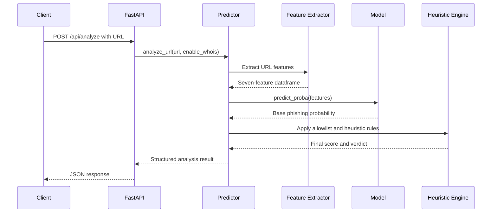

# Architecture

## Runtime Request Flow



## Application Boundaries

### Clients

The Streamlit dashboard and Chrome extension are presentation clients. They submit URLs and display the response; they do not own detection rules or model inference.

### API

`src/phishguard/api/app.py` owns HTTP concerns:

- Request validation through `URLAnalysisRequest`.
- Root and health endpoints.
- CORS configuration.
- Translation of analysis failures into HTTP errors.

`main.py` and `api/main.py` are launch/deployment adapters that import this shared application.

### Detection Engine

`src/phishguard/predictor.py` coordinates inference:

1. Locate and cache the model artifact.
2. Extract features from the URL.
3. Calculate the model probability.
4. Apply heuristic adjustments.
5. Return the response fields consumed by clients.

`feature_extractor.py` owns feature construction. `heuristic_engine.py` owns allowlisting, brand-spoof detection, risk adjustments, and verdicts.

### Training Pipeline

The training pipeline is intentionally separate from runtime inference:

1. `scripts/create_dataset.py` writes the canonical CSV dataset.
2. `scripts/train_model.py` loads the dataset.
3. A Random Forest classifier is trained with a fixed random seed.
4. The model is written to `models/phishing_model.pkl`.
5. A deployment copy is written to `api/phishing_model.pkl`.

## Model Inputs

The training and inference feature order must remain identical:

```text
url_length
has_at_symbol
has_https
no_of_dots
has_ip
hyphen_count
domain_age_days
```

Changing feature names, order, or meanings requires retraining the model and updating tests.

## Deployment Boundaries

- Local API: `main.py` imports `phishguard.api.app:app`.
- Vercel API: `api/main.py` imports the same application.
- Dashboard: `app.py` imports `phishguard.dashboard.app` for Streamlit execution.
- Browser extension: `extension/popup.js` calls a configured cloud endpoint and then the local API as a fallback.

This arrangement keeps business logic shared across local, dashboard, serverless, and extension workflows.
